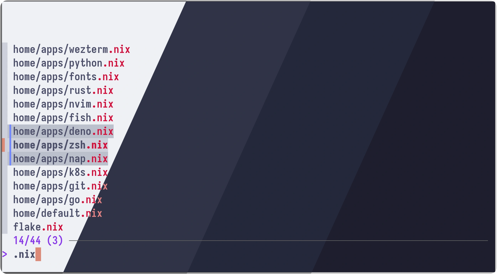
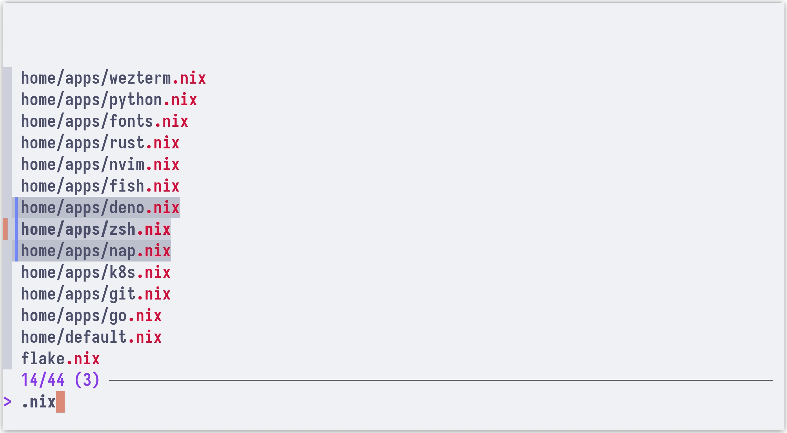
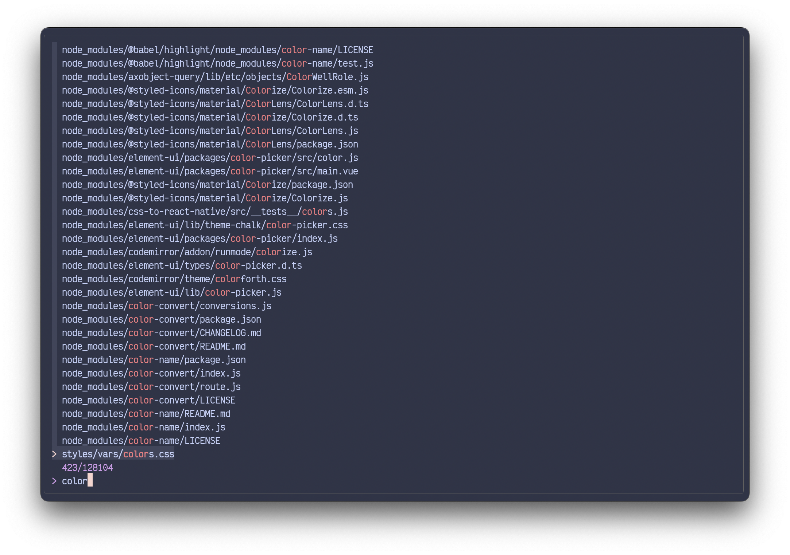
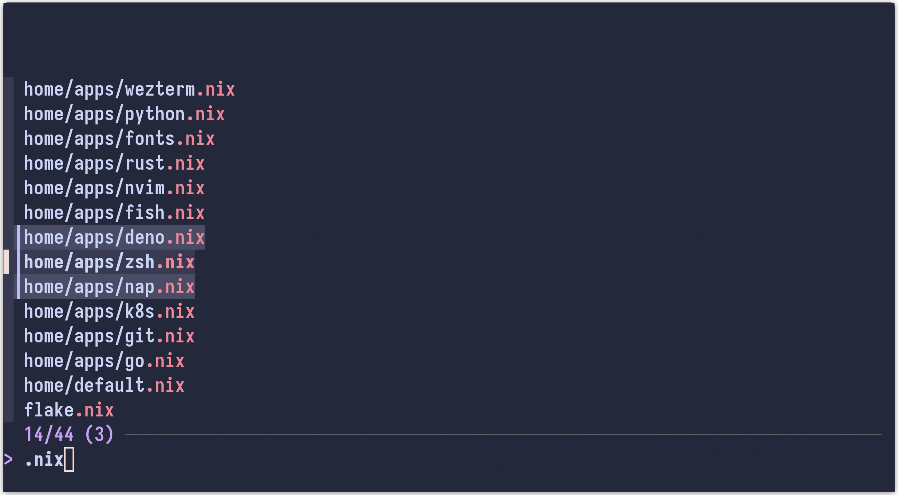
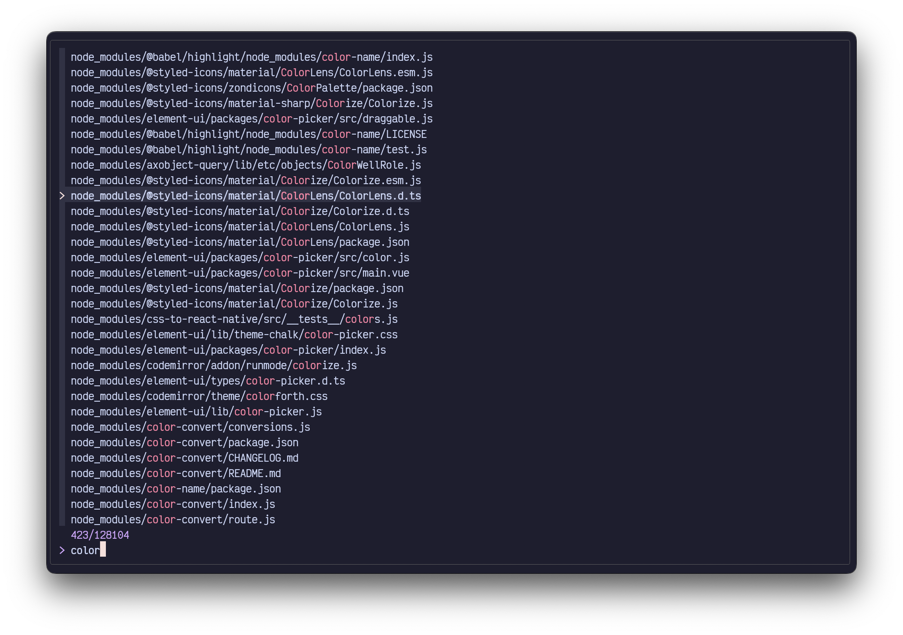

<h3 align="center">
	<br/>
	
	Catppuccin for <a href="https://github.com/junegunn/fzf">fzf</a>
	
</h3>

<p align="center">
    <a href="https://github.com/catppuccin/fzf/stargazers"></a>
    <a href="https://github.com/catppuccin/fzf/issues"></a>
    <a href="https://github.com/catppuccin/fzf/contributors"></a>
</p>

<p align="center">
		
</p>

## Previews
<details>
<summary>🌻 Latte</summary>

</details>
<details>
<summary>🪴 Frappé</summary>

</details>
<details>
<summary>🌺 Macchiato</summary>

</details>
<details>
<summary>🌿 Mocha</summary>

</details>

## Usage

1. Choose your flavour below.
2. Run a snippet based on your shell:
    - **Bash/Zsh**: add the Bash/Zsh snippet to your `~/.bashrc`, `~/.zshrc` or custom file loaded on shell startup:
    - **Fish**: run the Fish snippet once.
    - **PowerShell**: add the PowerShell snippet to your `~/Documents/PowerShell/Microsoft.PowerShell_profile.ps1`

> [!TIP]
> If you are using a transparent terminal background, remove the `bg` option in
> the following list of snippets.

<details>
<summary>🌻 Latte</summary>

**Bash/Zsh**:
```sh
export FZF_DEFAULT_OPTS=" \
--color=bg+:#ccd0da,bg:#eff1f5,spinner:#dc8a78,hl:#d20f39 \
--color=fg:#4c4f69,header:#d20f39,info:#8839ef,pointer:#dc8a78 \
--color=marker:#7287fd,fg+:#4c4f69,prompt:#8839ef,hl+:#d20f39 \
--color=selected-bg:#bcc0cc \
--color=border:#ccd0da,label:#4c4f69"
```

**Fish**:
```sh
set -Ux FZF_DEFAULT_OPTS "\
--color=bg+:#ccd0da,bg:#eff1f5,spinner:#dc8a78,hl:#d20f39 \
--color=fg:#4c4f69,header:#d20f39,info:#8839ef,pointer:#dc8a78 \
--color=marker:#7287fd,fg+:#4c4f69,prompt:#8839ef,hl+:#d20f39 \
--color=selected-bg:#bcc0cc \
--color=border:#ccd0da,label:#4c4f69"
```

**PowerShell**:
```powershell
$ENV:FZF_DEFAULT_OPTS=@"
--color=bg+:#ccd0da,bg:#eff1f5,spinner:#dc8a78,hl:#d20f39
--color=fg:#4c4f69,header:#d20f39,info:#8839ef,pointer:#dc8a78
--color=marker:#7287fd,fg+:#4c4f69,prompt:#8839ef,hl+:#d20f39
--color=selected-bg:#bcc0cc
--color=border:#ccd0da,label:#4c4f69
"@
```

</details>

<details>
<summary>🪴 Frappé</summary>

**Bash/Zsh**:
```sh
export FZF_DEFAULT_OPTS=" \
--color=bg+:#414559,bg:#303446,spinner:#f2d5cf,hl:#e78284 \
--color=fg:#c6d0f5,header:#e78284,info:#ca9ee6,pointer:#f2d5cf \
--color=marker:#babbf1,fg+:#c6d0f5,prompt:#ca9ee6,hl+:#e78284 \
--color=selected-bg:#51576d \
--color=border:#414559,label:#c6d0f5"
```

**Fish**:
```sh
set -Ux FZF_DEFAULT_OPTS "\
--color=bg+:#414559,bg:#303446,spinner:#f2d5cf,hl:#e78284 \
--color=fg:#c6d0f5,header:#e78284,info:#ca9ee6,pointer:#f2d5cf \
--color=marker:#babbf1,fg+:#c6d0f5,prompt:#ca9ee6,hl+:#e78284 \
--color=selected-bg:#51576d \
--color=border:#414559,label:#c6d0f5"
```

**PowerShell**:
```powershell
$ENV:FZF_DEFAULT_OPTS=@"
--color=bg+:#414559,bg:#303446,spinner:#f2d5cf,hl:#e78284
--color=fg:#c6d0f5,header:#e78284,info:#ca9ee6,pointer:#f2d5cf
--color=marker:#babbf1,fg+:#c6d0f5,prompt:#ca9ee6,hl+:#e78284
--color=selected-bg:#51576d
--color=border:#414559,label:#c6d0f5
"@
```

</details>

<details>
<summary>🌺 Macchiato</summary>

**Bash/Zsh**:
```sh
export FZF_DEFAULT_OPTS=" \
--color=bg+:#363a4f,bg:#24273a,spinner:#f4dbd6,hl:#ed8796 \
--color=fg:#cad3f5,header:#ed8796,info:#c6a0f6,pointer:#f4dbd6 \
--color=marker:#b7bdf8,fg+:#cad3f5,prompt:#c6a0f6,hl+:#ed8796 \
--color=selected-bg:#494d64 \
--color=border:#363a4f,label:#cad3f5"
```

**Fish**:
```sh
set -Ux FZF_DEFAULT_OPTS "\
--color=bg+:#363a4f,bg:#24273a,spinner:#f4dbd6,hl:#ed8796 \
--color=fg:#cad3f5,header:#ed8796,info:#c6a0f6,pointer:#f4dbd6 \
--color=marker:#b7bdf8,fg+:#cad3f5,prompt:#c6a0f6,hl+:#ed8796 \
--color=selected-bg:#494d64 \
--color=border:#363a4f,label:#cad3f5"
```

**PowerShell**:
```powershell
$ENV:FZF_DEFAULT_OPTS=@"
--color=bg+:#363a4f,bg:#24273a,spinner:#f4dbd6,hl:#ed8796
--color=fg:#cad3f5,header:#ed8796,info:#c6a0f6,pointer:#f4dbd6
--color=marker:#b7bdf8,fg+:#cad3f5,prompt:#c6a0f6,hl+:#ed8796
--color=selected-bg:#494d64
--color=border:#363a4f,label:#cad3f5
"@
```

</details>

<details>
<summary>🌿 Mocha</summary>

**Bash/Zsh**:
```sh
export FZF_DEFAULT_OPTS=" \
--color=bg+:#313244,bg:#1e1e2e,spinner:#f5e0dc,hl:#f38ba8 \
--color=fg:#cdd6f4,header:#f38ba8,info:#cba6f7,pointer:#f5e0dc \
--color=marker:#b4befe,fg+:#cdd6f4,prompt:#cba6f7,hl+:#f38ba8 \
--color=selected-bg:#45475a \
--color=border:#313244,label:#cdd6f4"
```

**Fish**:
```sh
set -Ux FZF_DEFAULT_OPTS "\
--color=bg+:#313244,bg:#1e1e2e,spinner:#f5e0dc,hl:#f38ba8 \
--color=fg:#cdd6f4,header:#f38ba8,info:#cba6f7,pointer:#f5e0dc \
--color=marker:#b4befe,fg+:#cdd6f4,prompt:#cba6f7,hl+:#f38ba8 \
--color=selected-bg:#45475a \
--color=border:#313244,label:#cdd6f4"
```

**PowerShell**:
```powershell
$ENV:FZF_DEFAULT_OPTS=@"
--color=bg+:#313244,bg:#1e1e2e,spinner:#f5e0dc,hl:#f38ba8
--color=fg:#cdd6f4,header:#f38ba8,info:#cba6f7,pointer:#f5e0dc
--color=marker:#b4befe,fg+:#cdd6f4,prompt:#cba6f7,hl+:#f38ba8
--color=selected-bg:#45475a
--color=border:#313244,label:#cdd6f4
"@
```

</details>

3. Enjoy!

## 💝 Thanks to

- [Sanjay Pavan](https://github.com/WitherCubes)

&nbsp;

<p align="center"></p>
<p align="center">Copyright &copy; 2021-present <a href="https://github.com/catppuccin" target="_blank">Catppuccin Org</a>
<p align="center"><a href="https://github.com/catppuccin/catppuccin/blob/main/LICENSE"></a></p>
