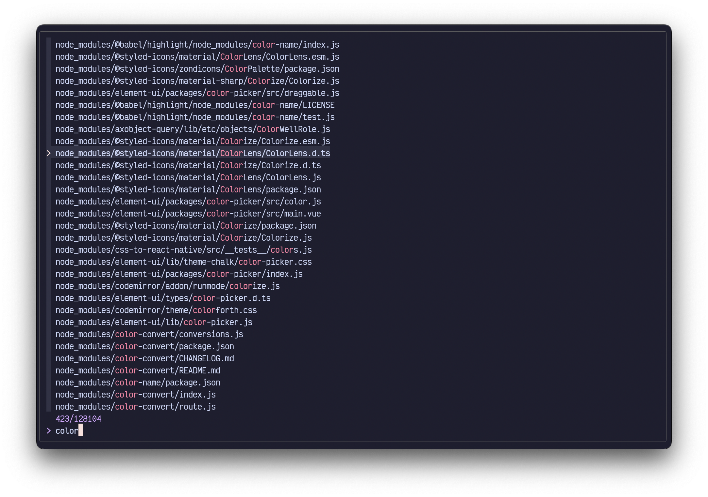

# Mocha

<p align="center">
  
</p>

## Usage

On Bash or ZSH, add the following to your `~/.bashrc`, `~/.zshrc` or another file loaded on your shell startup:

```sh
export FZF_DEFAULT_OPTS=" \
--color=bg+:#313244,bg:#1e1e2e,spinner:#f5e0dc,hl:#f38ba8 \
--color=fg:#cdd6f4,header:#f38ba8,info:#cba6f7,pointer:#f5e0dc \
--color=marker:#f5e0dc,fg+:#cdd6f4,prompt:#cba6f7,hl+:#f38ba8"
```

On Fish, run the following one time:

```sh
set -Ux FZF_DEFAULT_OPTS "\
--color=bg+:#313244,bg:#1e1e2e,spinner:#f5e0dc,hl:#f38ba8 \
--color=fg:#cdd6f4,header:#f38ba8,info:#cba6f7,pointer:#f5e0dc \
--color=marker:#f5e0dc,fg+:#cdd6f4,prompt:#cba6f7,hl+:#f38ba8"
```
